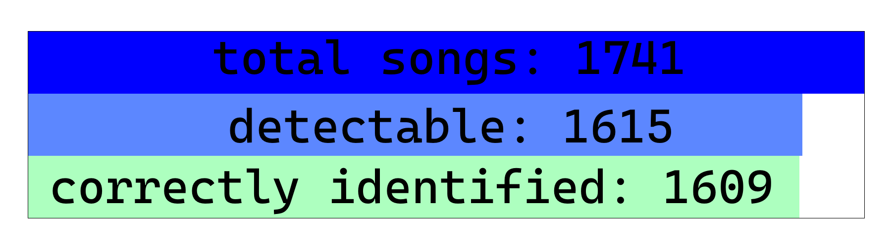

# BpmOffsetDetector

BpmOffsetDetector is a Python script designed to analyze and detect BPM (beats per minute) and offsets for music, primarily for [developing games](#Author) or for personal use.

## Features
- Detects a BPM for a static BPM songs where BPM is a whole number or is at least divisible by 0.5
- Detects an offset for a song to know where the beats fall 
- Simple and easy-to-use Python script

## Limits
- It can't be used to track beats for song with changing BPMs
- It assumes song's BPM is a whole number, which is fine most of the time, but not always.  

## Usage
1. Make sure ffmpeg is installed on your pc
2. You'll need a librosa library as a dependency
3. Call it when you need to find out BPM for a song and/or song offset:
```python
import bpm_offset_detector

bpm, subdivision, offset, add = bpm_offset_detector.detect('path/to/my/song.ogg')
print(bpm) # 125
print(subdivision) # 4
print(offset) # 0.123 
print(add) # 0.357
# append 0.357 seconds of silence to make the song's first beat start at exactly 0.0 seconds
# apply some game logic every 1/4 of a beat
```


## Some stats

Out of 1741 songs with static BPM tested:
- only 1615 songs are considered to be detectable (meaning their bpm is divisible by 0.5)
- Out of them, 1609 were detected correctly, implying 99.63% success rate for detectable scenarios and 92.42% success rate overall (keep in mind real world usage will probably be less, since variable bpm songs exist)

## Author
- Maklas
- This algorithm is currently used in BeatSaber map generator [LazyMapper](https://www.reddit.com/r/beatsaber/comments/1hwtgxq/i_made_a_map_generator/) 